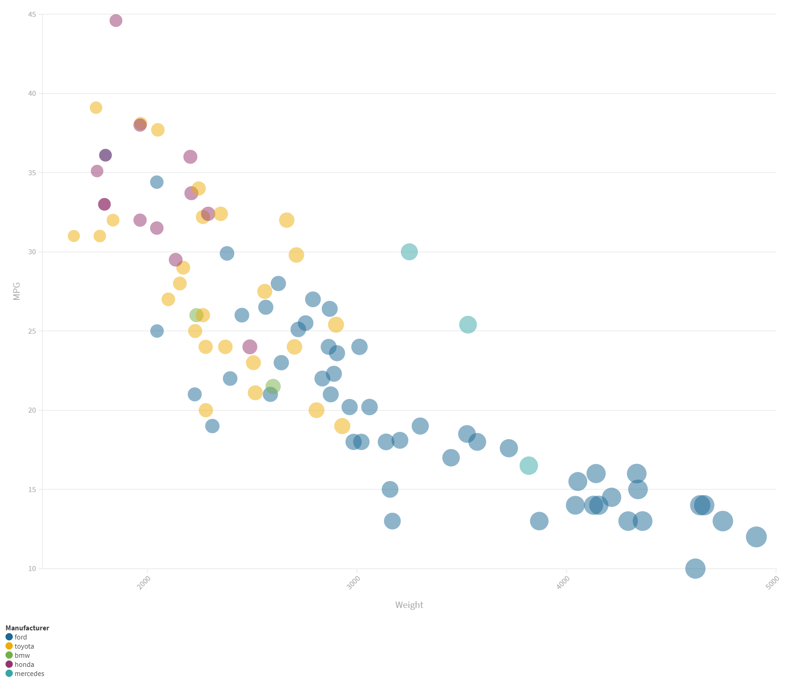

# 02-DataVis-5ways

Assignment 2 - Data Visualization, 5 Ways  
===

# R + ggplot2 
My first implementation uses R and ggplot2 to  create the visualization of the car data. You can view a screenshot of the visualization .

Sources:
* https://flowingdata.com/2010/11/23/how-to-make-bubble-charts/
* https://www.r-graph-gallery.com/320-the-basis-of-bubble-plot.html

# Python + matplotlib + pandas
My second implementation uses Python, matplotlib, and pandas to create the visualization of the car data. You can view a screenshot of the visualization .

Sources:
* https://pandas.pydata.org/pandas-docs/stable/user_guide/indexing.html
* https://www.tutorialspoint.com/python_data_science/python_bubble_charts.htm
* https://glowingpython.blogspot.com/2011/11/how-to-make-bubble-charts-with.html
* https://python-graph-gallery.com/270-basic-bubble-plot/

# D3JS
My third implementation uses D3Js and JavaScript to create the visualization of the car data. You can view a screenshot of the visualization .

Sources:
* https://www.d3-graph-gallery.com/graph/bubble_basic.html
* https://www.d3-graph-gallery.com/graph/bubble_template.html

# Excel
My fourth implementation uses Excel to create the visualization of the car data. You can view a screenshot of the visualization .

Steps to import data: Data -> Get Data -> Get File -> From_Text/CSV

I created 10 more columns (in groups of 2) after importing the original CSV file into Excel. Each group of columns that I created had an 'MPG' column and a 'Weight' column.
I copy and pasted the information for each of the 5 manufacturers into their appropriate columns. I then inserted a blank bubble chart, and added a data series for each of the MPG/WEight columns groupings for each manufacturer. I used 'Format Chart Area' to incorporate the following features:

* changing the scale of the x-axis and y-axis
* adding a legend
* adding labels on the x-axis and y-axis

# Flourish 

My fifth implementation uses Flourish to create the visualization of the car data. You can view a screenshot of the visualization . Flourish is a data visualization software that has a really great UI for users to implement data visualizations. In order to create my visualization, I selected to create a bubble chart, and imported the cars-sample.csv file into the visulaization. Then, I adjusted the appropriate attributes using Flourish's intuitive UI.

### Design Achievements
In my d3js implementation, I added an extra feature. Users can hover over a bubble, and it displays the manufacturer that the car is associated with. I completed this by following [this tutorial](https://www.d3-graph-gallery.com/graph/bubble_template.html).
